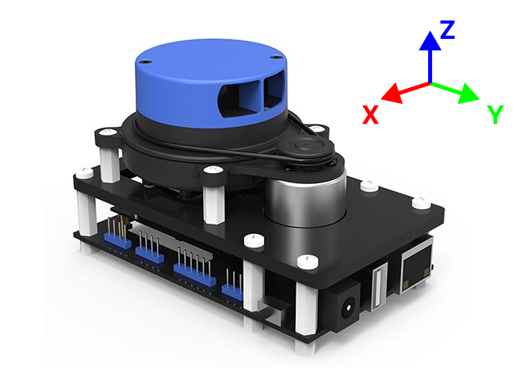
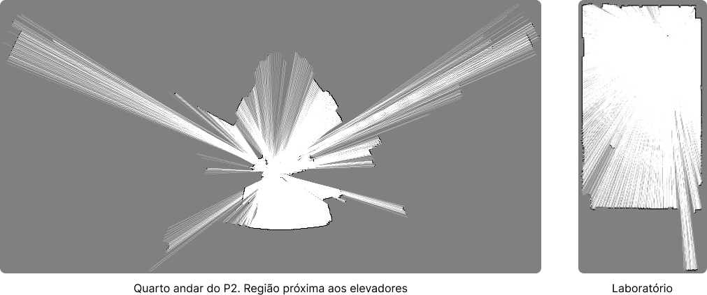

# LIDAR 

- **Alunos:** Cicero Tiago Carneiro Valentim / Diego Saragoza da Silva
- **Curso:** Engenharia da Computação
- **Semestre:** 10 / 9
- **Contato:** cicerotcv@al.insper.edu.br / diegoss3@al.insper.edu.br
- **Ano:** 2023

## Começando

Para seguir este tutorial, é necessário:

- **Hardware:** 
    - Computador Linux
    - LIDAR M1M1 SLAMTEC
- **Softwares:** 
    - GCC 9.4.0
    - SDK do LIDAR
    - Ferramentas de edição de texto (como um editor de texto ou IDE)
- **Documentos:** 
    - Documentação do LIDAR (se disponível)

## Motivação

Este tutorial visa orientar os usuários sobre como compilar o GCC 9.4.0 e o SDK 
do LIDAR, fornecendo orientações detalhadas passo a passo. A compilação do 
GCC 9.4.0 é crucial para permitir a compatibilidade necessária ao trabalhar com 
o LIDAR.

## Compilar o GCC 9

Para trabalhar com o LIDAR, é necessário instalar a versão específica do GCC, 
a 9.4.0. Para isso, você pode seguir algum tutorial de sua escolha ou, possívelmente,
o fornecido a seguir.

### Sugestão de passos para compilar o GCC 9

#### Requisitos
- Sistema operacional Linux com acesso à internet;
- Alguns _Gigabytes_ de armazenamento livre (10 GB devem ser suficientes);
- Ferramentas básicas de compilação, como `make`, `cmake`, etc.;

!!! warning "Reserve tempo"
    Essa etapa pode facilmente consumir algumas horas.

#### Download

Inicialmente, vá ao diretório onde quer baixar e compilar o GCC. Para simplificar, 
chamaremos de `/your/project/root/`.

```bash
wget https://ftp.gnu.org/gnu/gcc/gcc-9.4.0/gcc-9.4.0.tar.gz
```

#### Descompressão

Faça a descompressão. Isso deve gerar uma pasta `gcc-9.4.0/` no seu diretório atual.

```bash
tar -xvf gcc-9.4.0.tar.gz
```

#### Instalação das dependências

Entre na pasta `gcc-9.4.0/` e instale as dependências utilizando o script:

```bash
cd gcc-9.4.0
./contrib/download_prerequisites
cd ..
```

#### Configuração da instalação

Crie uma pasta `gcc-build/`:

```bash
mkdir gcc-build
```

Nessa etapa, você deve ter a seguinte estrutura de pastas:

```
├── /your/project/root/
│   ├── gcc-9.4.0/
│   ├── gcc-build/
```

Entre na pasta `gcc-build/`.

```bash
cd gcc-build
```

Execute o comando de configuração.

```bash
../gcc-9.4.0/configure              \
    --prefix=/usr/local/gcc-9.4.0   \
    --disable-multilib              \
    --disable-shared                \
    --disable-libgomp               \
    --disable-libquadmath           \
    --with-newlib                   \
    --enable-static                 \
    --enable-languages=c,c++        \
    --without-headers
```

!!! info "Em caso de erro"
    Em caso de erro, recomenda-se que apague todo o conteúdo da pasta `gcc-build/`
    e execute novamente o comando `configure` acima antes de testar alguma solução. 

#### Compilação 

Ainda dentro da pasta `gcc-build/`, podemos iniciar a compilação utilizando o 
maior número de processos disponível.

!!! warning "Aviso"
    1. Aguarde alguns minutos por possíveis erros  na fase inicial e então vá 
    fazer alguma outra coisa. Essa etapa pode levar algumas horas. 
    2. Antes de continuar, verifique se possui pelo menos alguns _gigabytes_
    de armazenamento desocupados.

```bash
make -j$(nproc)
```

#### Instalação 

Instale o **GCC 9.4.0**:

```bash
make install -j$(nproc)
```

#### Verificação da instalação

Se o comando a seguir não retornar nenhum erro, a instalação deve ter sido bem sucedida.

```bash
/usr/local/gcc-9.4.0 --version
```


## Compilar o SDK do LIDAR

### Requisitos
- GCC 9.4.0 instalado
- SDK do LIDAR baixada e descompactada em um diretório acessível

Esse passo é dividido em duas partes. A primeira é a de correção de alguns erros 
ineretes ao projeto para que a compilação seja bem sucedida e o segundo é o 
próprio passo de compilação.

### Download do SDK

Baixe o SDK para o GCC 9 que está disponível em https://www.slamtec.com/en/support#rplidar-mapper 
e extraia em algum local de fácil acesso em seu computador.

### Patches no SDK

Antes de continuar, precisamos corrigir dois erros no kit de desenvolvimento.

#### Patch na biblioteca `boost`

Acesse biblioteca `boost`, que está presente no projeto via `include`. Acesse o 
arquivo `thread_data.hpp` disponível em `linux-x86_64-release/include/boost/thread/pthread/` 
e adicione a seguinte correção imediatamente após a **linha 35**:

```c
#undef PTHREAD_STACK_MIN
#define PTHREAD_STACK_MIN 16384
```

#### Patch no arquivo `mak_def.inc`

No arquivo `mak_def.inc` presente na raiz do SDK, edite a **linha 50**, alterando 
o valor da variável `CC` para `gcc-9`. Isso mudará o compilador de C do projeto 
para o recém compilado e instalado **GCC 9**. Por fim, acesse a pasta `samples/`, 
também na raiz do projeto, e então execute o comando de compilação:

```bash
make -j$(nproc)
```

Muito provavelmente você verá alguns _warnings_ e talvez alguns erros de linking. 
Infelizmente, apenas um dos exemplos fornecidos pela Slamware é compilável no 
estado em que foi disponibilizado, o `map2bmp`, e é ele que será utilizado para fins
de demonstração de como o SDK e o LIDAR operam.


!!! note "Se der certo..."
    Se tudo der certo, será gerado na pasta `linux-x86_64-release/output/` um 
    executável chamado `map2bmp`.

    Execute ele e veja os parâmetros que ele precisa para se conectar ao LIDAR:

    ```bash
    ./map2bmp
    ```

## Testando o LIDAR





### Requisitos
- Computador Linux:
    - capaz de executar o programa compilado anteriormente `map2bmp`;
    - capaz de se conectar via `Wi-Fi`;
- Fonte de alimentação para o **LIDAR M1M1** da Slamtec;

### Alimentação

Conecte o LIDAR via USB no seu computador ou então a alguma fonte para 
que opere corretamente. 

### Conexão

A conexão ao LIDAR é feita via `Wi-Fi`. Após conectá-lo à fonte de alimentação,
ele deve levar algo entre 20 e 30 segundos para entrar em atividade e diponibilizar 
a rede **SLAMWARE-xxx**.


### Funcionamento

O dispositivo realiza medições continuamente enquanto está em atividade e armazena 
de forma **iterativa** os pontos conhecidos no ambiente, permitindo que o usuário 
realize deslocamentos espaciais para aumentar a qualidade do mapeamento.

Quando o programa `map2bmp` é exectado, ele gera o arquivo de imagem `.bmp` (bitmap) 
todo o mapeamento que foi possível de realizar até o momento.

Para executar o programa:

```bash
# output_file é o nome do arquivo de imagem que será gerado;
# 192.168.11.1 é o IP do dispositivo na rede interna;

./map2bmp -o output_file "192.168.11.1"
```

!!! note "Orientação"
    O sensor guarda informações de orientação como posição `(x, y, z)` e rotação 
    (em torno do eixo `z`) para construir uma projeção do ambiente que está sendo mapeado.


### Demonstração

Para fins de demonstração, foram geradas as duas imagens a seguir.

A primeira foi obtida meapeando o centro do quarto andar do prédio 2, na região 
próxima aos elevadores. A segunda é o mapeamento da sala de aula (laboratório) 
com os contornos melhor definidos por se tratar de um ambiente menor.




## Trabalhos futuros

A seguir, listamos algumas ideias de aplicações que podem ser desenvolvidas a partir
deste ponto.

### Mapeamento Realtime + Streaming de Frames

Explore a possibilidade de adaptar o script `map2bmp` para transmitir em tempo 
real as imagens capturadas pelo LIDAR como frames de vídeo pela rede.

Uma biblioteca como OpenCV para receber e processar esse fluxo de imagens em 
tempo real. Isso pode permitir a criação de um sistema de mapeamento dinâmico e contínuo.

### Mapeamento Móvel

Conecte o LIDAR a um veículo móvel (ex. um carro de controle remoto, drone, **aranha do Lab**). 
Com isso, é possível realizar varreduras em movimento do ambiente. 

## Referências

**Building GCC-9.1.0 from Source**. Disponível em:
https://www.youtube.com/watch?v=QfPpT0O9m2k

**Manually install GCC version**. Disponível em:
https://hackmd.io/@Chieh/r1HuqO_b5

**RE: I can't install gcc 9**. Disponível em:
https://www.spinics.net/lists/gcchelp/msg50130.html

**5.5. GCC-9.2.0 - Pass 1**. Disponível em:
https://www.linuxfromscratch.org/lfs/view/9.1-systemd/chapter05/gcc-pass1.html

**gcc 4.8.1 will not make**. Disponível em:
https://stackoverflow.com/questions/18242322/gcc-4-8-1-will-not-make

**How to determine the maximum number to pass to make -j option?**. Disponível em:
https://unix.stackexchange.com/questions/208568/how-to-determine-the-maximum-number-to-pass-to-make-j-option

**What does make -jn mean?**. Disponível em:
https://unix.stackexchange.com/questions/257403/what-does-make-jn-mean

**Bootstrap error: libcc1 compiled as shared library despite --disable-shared**. Disponível em:
https://gcc.gnu.org/bugzilla/show_bug.cgi?id=66955

**All you need to know about Slamtec RPLIDAR, MAPPER and Slamware**. Disponível em: 
https://www.seeedstudio.com/blog/2019/08/05/all-you-need-to-know-about-slamtec-rplidar-mapper-and-slamware/